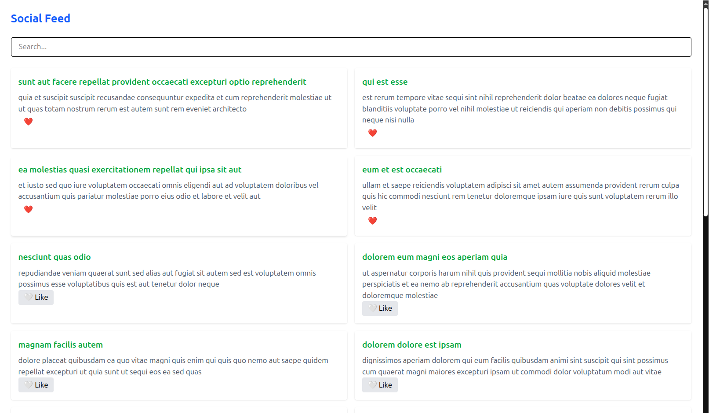

📱 Social Feed App (React + API)
🚀 Overview
This is a dynamic Social Feed web application built using React. It fetches real-time data from an external API and displays posts in a clean, interactive UI.

The project focuses on handling API data, state management, and user interaction, making it a strong step toward real-world frontend development.

✨ Features
🌐 Fetch posts from external API

⏳ Loading state handling

❌ Error handling for failed requests

🔍 Real-time search/filter posts

📉 Optimized data loading (limited posts)

➕ “Load More” pagination

❤️ Like button (interactive UI state)

🧩 Reusable components (PostCard)

📱 Responsive grid layout

🧠 Tech Stack
React – UI library

Vite – Development environment

Tailwind CSS – Styling

Fetch API – Data fetching

📁 Project Structure
src/
│
├── components/
│   └── PostCard.jsx
│
├── pages/
│   └── Home.jsx
│
├── App.jsx
└── main.jsx
⚙️ Installation & Setup
Clone the repository:

git clone https://github.com/Naptile/social-feed-App.git
cd social-feed-app
Install dependencies:

npm install
Run the app:

npm run dev
🌐 API Used
https://jsonplaceholder.typicode.com/posts
Free fake API for testing and learning

Returns a list of posts with title and body

🧠 Key Concepts Learned
React state management (useState)

Side effects (useEffect)

API fetching (fetch)

Conditional rendering (loading & error states)

Controlled inputs (search functionality)

Array methods (map, filter, slice)

Component reusability

UI state handling (like button)

📸 Screenshots

🚀 Deployment
You can deploy this app using:

Vercel

Netlify

📌 Future Improvements
👤 User profiles

💬 Comments section

🔔 Notifications

🌐 Real backend integration

📄 Pagination with API (server-side)

👨‍💻 Author
Naptile

⭐ Support
If you like this project, give it a ⭐ on GitHub!